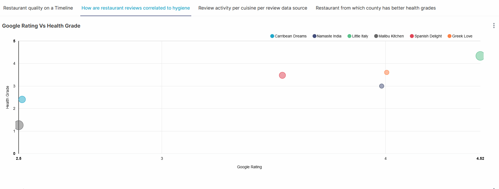
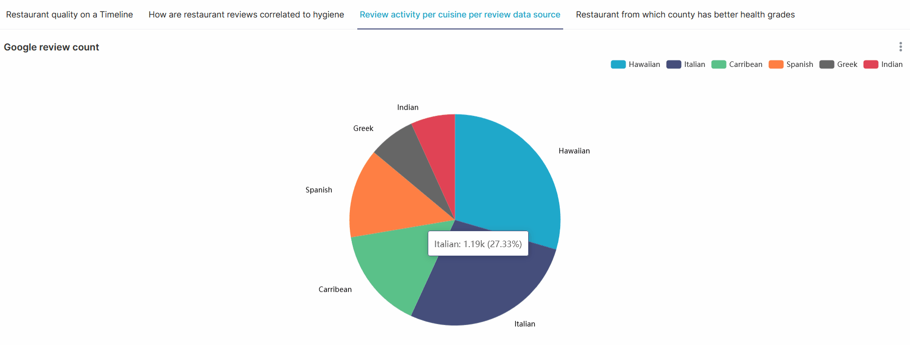

# EatFoodWise (Restaurant quality metrics aggregator)

## Vision

- Goal of the project is to build a data pipeline aggregating various data points pertaining to restaurants collected from a variety of data sources and providing analytical insights into restaurant quality over a timeline.

- While choosing a restaurant, **customers** look at various quality metrics(ambience, taste, service, hygiene) and a lot of review sites to make their decision. It is also commonly observed that restaurant quality varies for better/worse over a timespan. Our goal is to visualize these metrics in an easily observable way to help customers with their choices. The restaurant insights  are also informative to **restaurant owners/corporate chains** to come up with action items to improve restaurant performance.
- Not all metrics are available from all the data sources. For example, restaurant hygiene related data points are gathered from data published by city health departments. Note: Extraction of data, not available via apis, can be done via web scraping etc. Work pertaining to this is considered out of scope of this project.

## Business Insights 

### How are restaurant reviews correlated to health grade
 

- Various restaurant metrics representing quality could be correlated. For example, a restaurant with consistent low health grades is very likely to also have bad review ratings. It will be helpful for the customers when there is a visualization of correlation between various data points like restaurant rating vs hygiene.
  

### Restaurant quality over a timeline
   
  

  - Customers might want to know how a restaurant has fared over a specific time period. It is not uncommon for restaurant quality to take a sharp turn for better or worse due to various reasons(management change, cost cutting measures, stress on profits etc). These changes will not be reflected over average review ratings provided by various review sites.
   

### Review count per cuisine per site
   

  - We cannot simply trust the average review value alone. Different review sites have different counts of reviews for a particular restaurant. It is helpful to see the distribution of review counts per cuisine per review_site. Outliers in ratings collected from different review sites could indicate potential fraud.
  

## Design

- Restaurant quality metrics are aggregated from various data sources(google, yelp reviews, health department grades etc).
- Data ingestion into the system is  done using various triggers
  - AWS cloudwatch cron: Raw data uploaded to S3 is processed as micro batches using glue jobs.
  - On-demand triggers for glue jobs
- Data collected is fed into data processing pipeline, built off [AWS Glue](https://docs.aws.amazon.com/glue/latest/dg/what-is-glue.html)(serverless data integration and ETL tool) using [S3](https://docs.aws.amazon.com/AmazonS3/latest/userguide/Welcome.html)(AWS's object storage service) as the storage layer.
  When raw data is ingested into the Amazon S3 storage bucket, an AWS Glue job is intiated by an AWS CloudWatch trigger. The Glue job processses and transform the raw data applying necessary filters, removing duplicates and adding calculated fields. Job Bookmarks are used to keep track of which data is already processed preventing reprocessing of unchanged data in the S3 bucket. The transformed data is then stored into another Amazon S3 bucket. This triggers an AWS Glue Crawler to run thereby determining the schema of the data, creating the data partitions and populating the AWS Glue Catalog.
- Data post extraction/transformation in the AWS Glue Catalog is exposed for interactive analytics on [Aws Athena](https://docs.aws.amazon.com/athena/latest/ug/what-is.html)(Presto based distributed query engine). Standard SQL queries can be run on the Data for further analysis.
- Athena service is integrated with [Apache Superset](https://superset.apache.org/docs/intro/) (an open source data visualization tool) to provide further data exploration and visualization capabilities.

- The data visualized using Apache Superset  is hosted on [DigitalOcean droplet](https://docs.digitalocean.com/products/droplets/) as a cost-effective method to create and share the visualization.

<!-- ## [Dashboard](TBD)
 -->

 

## Read/Write Paths
 

